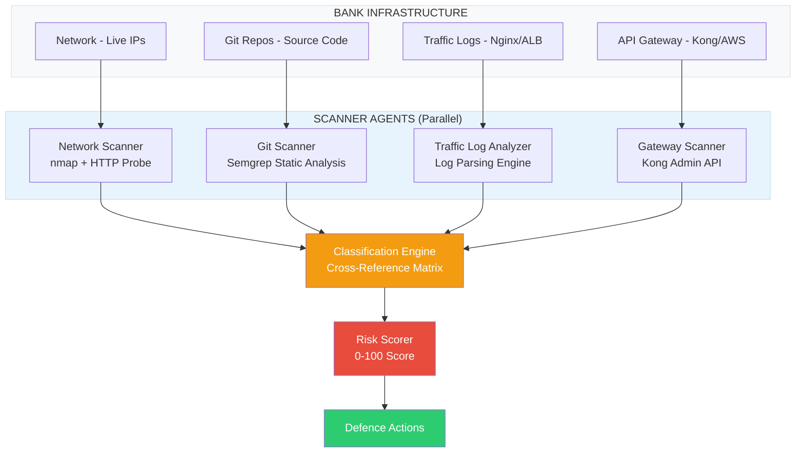
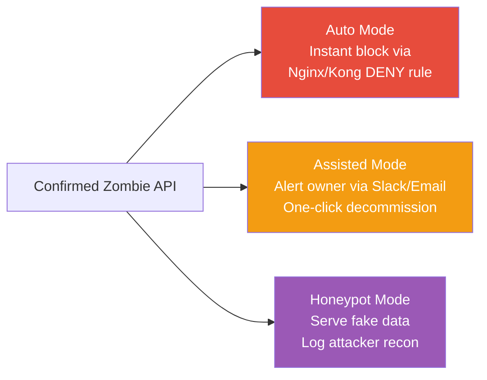
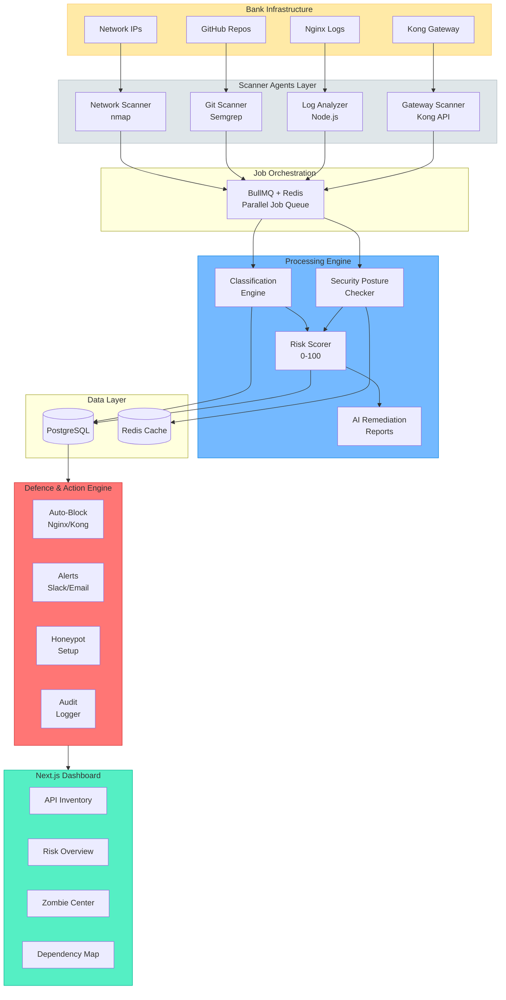
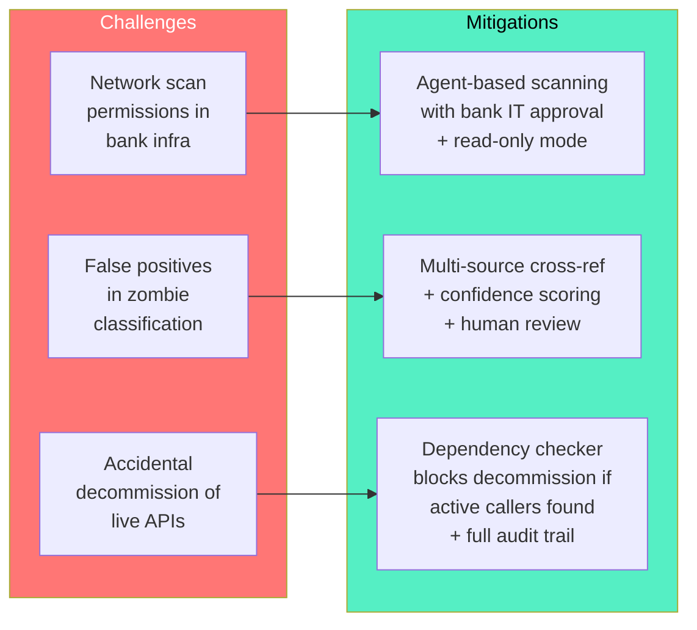
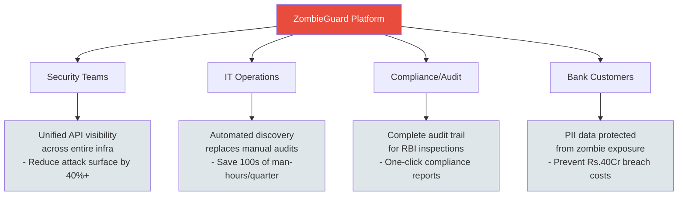
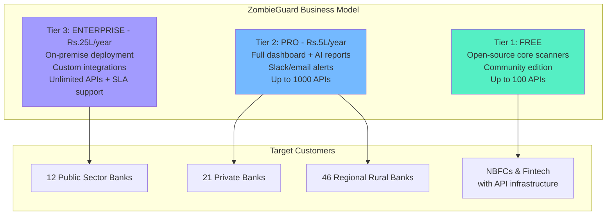

# ZombieGuard - Hackathon PPT Content

> iDEA 2.0 | PSBs Hackathon Series 2026 | PS9

---

## Slide 1: Header Slide

**Already provided in template** - Union Bank of India + Somaiya branding

---

## Slide 2: Problem Statement & Team Details

**TEAM NAME:** Team TMKB

**PROBLEM STATEMENT TITLE:** PS9 - Automated Zombie API Discovery & Defence Platform for Banking Infrastructure

| | NAME | GENDER | AREA OF EXPERTISE |
|---|---|---|---|
| Member 1 | *(Fill)* | *(Fill)* | Backend & Security |
| Member 2 | *(Fill)* | *(Fill)* | Frontend & Visualization |
| Member 3 | *(Fill)* | *(Fill)* | DevOps & Infrastructure |
| Member 4 | *(Fill)* | *(Fill)* | AI/ML & Data Analysis |

---

## Slide 3: Proposed Solution (Idea Title)

### ZOMBIEGUARD - Automated Zombie API Discovery & Defence Platform

**The Problem:**
Banks accumulate APIs over years — mobile apps get rebuilt, services get migrated, teams change — but old APIs rarely get shut down. These forgotten "zombie APIs" remain live with no monitoring, no auth updates, and often expose sensitive customer data.

- **40%** of enterprise APIs are undocumented or abandoned (Gartner)
- Zombie/Shadow APIs rank in **OWASP API Security Top 10** (API9:2023)
- Average breach cost in Indian banking: **Rs. 40 crore per incident** (IBM Security 2024)

**Our Solution:**
ZombieGuard discovers every API across the bank's infrastructure using 4 independent scanner agents, classifies them (Active / Deprecated / Zombie / Shadow / Orphaned), scores security risk (0-100), and provides automated decommissioning — all from a single dashboard.

**Key Insight:** No single source tells the full story. An API can exist in code but not the gateway (shadow), in the gateway but not in code (orphaned), or in neither but still responding on the network (zombie). Cross-referencing all four sources is what makes zombie detection possible.

---

## Slide 4: Outline of Unique & Innovative Solution

### Multi-Source Discovery Engine

### Classification Matrix (The Innovation Core)

| Status | In Gateway | In Code | Has Traffic | Risk Level |
|---|---|---|---|---|
| **Active** | Yes | Yes | Yes | Monitor |
| **Deprecated** | Yes | Yes | No | Plan removal |
| **Shadow** | No | No | Yes | URGENT - unknown API with live traffic |
| **Zombie** | No | No | No | Decommission - responds but nobody owns it |
| **Orphaned** | Yes | No | No | Review & clean up |

### Three Defence Modes (Industry First)

**Honeypot Innovation:** Instead of just blocking zombies, ZombieGuard can turn them into attacker detection tripwires — serving fake data while logging source IPs, headers, and geolocation. Turns a vulnerability into a security asset.

---

## Slide 5: Technical Approach

### Tech Stack

| Layer | Technology | Purpose |
|---|---|---|
| Frontend | Next.js 14 + Tailwind + Shadcn/ui | Dashboard with SSR |
| Visualization | Recharts + React Flow | Risk graphs, API dependency map |
| Backend | Node.js + Express | API server & scanner orchestration |
| Job Queue | BullMQ + Redis | Parallel background scanner jobs |
| Scheduling | node-cron | Automated scans every 6 hours |
| Database | PostgreSQL | API registry, audit logs, scan history |
| Security Scan | OWASP ZAP (Docker) | Automated vulnerability testing |
| Static Analysis | Semgrep (CLI) | Code scanning for route definitions |
| Network Scan | nmap (CLI) | Port scanning & host discovery |
| AI Reports | Claude API | Remediation report generation |
| Infrastructure | Docker Compose | Full platform packaging |

### Architecture Flowchart

### Security Assessment Scoring

| Check | Method | Score Impact |
|---|---|---|
| Authentication | Request with no auth header | -30 |
| Encryption | HTTP vs HTTPS check | -20 |
| Rate Limiting | 100 requests in 5s burst | -15 |
| PII Exposure | Scan for Aadhaar/PAN/CVV | -25 |
| OWASP ZAP | 40+ automated vuln checks | -10 to -20 |
| Staleness | Last code update > 1 year | -10 |
| Ownership | No team assigned | -5 |

**Score Ranges:** 80-100 Low Risk | 50-79 Medium | 20-49 High | 0-19 Critical

---

## Slide 6: Feasibility & Viability

### Feasibility Analysis

**Technically Feasible - Built on Proven Tools:**
- All scanner components use industry-standard tools (nmap, Semgrep, OWASP ZAP) already deployed in bank security teams
- Node.js + PostgreSQL stack is mature, well-supported, and bank-approved
- Docker Compose packaging means single-command deployment in any environment

**Demo-Ready Architecture:**
- Mock bank APIs simulate real zombie/shadow/active endpoints on local ports
- Full scan-to-decommission cycle runs in under 5 minutes
- No dependency on real bank infrastructure for demonstration

### Potential Challenges & Mitigations

### RBI Compliance Ready
- Every action is human-approvable (Assisted Mode is default)
- Full audit trail logged in `audit_logs` table — who, what, when, old/new state
- Aligns with RBI's IT Risk & Cyber Security Framework requirements
- No data leaves the bank's network — fully on-premise deployment

---

## Slide 7: Impact & Benefits

### Impact on Target Audience (Public Sector Banks)

### Key Benefits

| Category | Benefit | Metric |
|---|---|---|
| **Security** | Eliminate zombie APIs exposing PII with no auth | Reduce attack surface by 40%+ |
| **Economic** | Prevent data breaches via forgotten endpoints | Save Rs. 40 Cr avg breach cost |
| **Operational** | Replace manual quarterly audits with continuous scanning | Scans every 6 hours automatically |
| **Compliance** | Full audit trail for every API lifecycle action | RBI IT Risk Framework aligned |
| **Innovation** | Honeypot mode turns vulnerabilities into detection tools | Early warning on attacker recon |

### OWASP API Security Top 10 Coverage

ZombieGuard directly addresses 3 of the OWASP API Security Top 10:
- **API9:2023** — Improper Inventory Management (the core zombie problem)
- **API1:2023** — Broken Object Level Authorization (zombies run with no auth)
- **API3:2023** — Broken Object Property Level Authorization (zombies return full PII objects)

---

## Slide 8: Business Model

### Revenue Model

### Commercialization & Scalability

**Target Market:**
- 12 PSBs + 21 Private Banks + 46 RRBs = **79 scheduled commercial banks** in India
- Each managing thousands of APIs with no unified zombie detection today
- Total addressable market: Rs. 200+ Cr annually (banking API security segment)

**Go-to-Market Strategy:**
1. **Pilot with Union Bank of India** (hackathon sponsor) — validate in real PSB environment
2. **IBA (Indian Banks' Association) partnership** — distribute across all member banks
3. **RBI compliance push** — position as the tool for IT Risk Framework API inventory requirement
4. **Expand to fintech/NBFC** — lighter SaaS tier for smaller institutions

**Scalability:**
- Docker Compose architecture scales horizontally — add scanner nodes as API count grows
- PostgreSQL handles millions of API records; Redis ensures real-time scan performance
- Plugin architecture allows adding new scanner types (AWS API Gateway, Apigee, etc.)

---

## Slide 9: Research & References

### References

1. **OWASP API Security Top 10 (2023)** — API9:2023 Improper Inventory Management
   - Framework for zombie/shadow API risk classification
2. **Gartner Report (2024)** — "40% of enterprise APIs are undocumented or abandoned"
   - Statistical basis for the zombie API problem scope
3. **IBM Security Cost of Data Breach Report (2024)** — India banking sector analysis
   - Rs. 40 Cr average breach cost in Indian banking
4. **RBI IT Risk & Cyber Security Framework** — Compliance requirements for API inventory and audit trails
5. **Akto.io** — Open-source API discovery through traffic analysis (integrated as scanner)
6. **OWASP ZAP** — Industry-standard automated security testing tool (integrated for vuln scanning)
7. **Semgrep** — Static analysis engine for code pattern matching (used for git-based route discovery)

### Tools & Frameworks Referenced
- nmap (network scanning), BullMQ (job queues), React Flow (dependency visualization)
- Kong Gateway API, Nginx configuration management

### One-Page Summary
> **[Add Google Drive link to one-page PDF summary here]**
> *(Must be accessible with "Anyone with the link can view" permission)*

---

## One-Page Summary (Separate PDF)

### ZombieGuard - Automated Zombie API Discovery & Defence Platform

**Problem:** Banks accumulate APIs over years but rarely decommission old ones. These "zombie APIs" remain live with no monitoring, outdated auth, and often expose sensitive PII. 40% of enterprise APIs are undocumented (Gartner), and the average banking breach costs Rs. 40 Cr (IBM 2024). This is OWASP API9:2023 — Improper Inventory Management.

**Solution:** ZombieGuard is an end-to-end platform that discovers every API across a bank's infrastructure using 4 parallel scanner agents (Network/nmap, Git/Semgrep, Traffic Logs, API Gateway), cross-references findings to classify APIs (Active, Deprecated, Zombie, Shadow, Orphaned), scores security risk (0-100) via auth/encryption/rate-limit/PII/ZAP checks, and provides automated decommissioning with three modes: Auto-block, Human-assisted, or Honeypot (turns dead APIs into attacker detection tripwires).

**Tech Stack:** Next.js 14 dashboard, Node.js/Express backend, PostgreSQL + Redis, BullMQ job queue, Docker Compose deployment. Integrates nmap, Semgrep, OWASP ZAP, and Claude AI for remediation reports.

**Key Differentiators:** (1) Multi-source cross-referencing — no single scanner finds all zombies, (2) End-to-end lifecycle from discovery to decommission, (3) Honeypot mode innovation, (4) RBI compliance-ready with full audit trails, (5) Industry-standard security tooling.

**Impact:** Eliminates zombie API attack surface, prevents Rs. 40 Cr breach incidents, replaces manual audits with continuous 6-hour scan cycles, provides RBI-ready compliance trail. Target market: 79 scheduled commercial banks in India.
